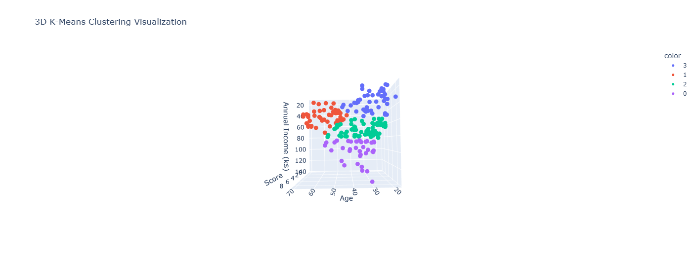

# K-Means_MallCustomers

A K-Means clustering model trained on the [Mall Customers dataset](https://www.kaggle.com/datasets/shwetabh123/mall-customers/versions/1) to segment individuals based on their age, annual income, and spending score.  
The goal is to identify distinct groups of shoppers with similar demographic and spending characteristics.

---

## About the Dataset

The dataset contains **200 rows** and **5 columns**:

| Column | Description |
|:--------|:-------------|
| CustomerID | Unique identifier for each customer |
| Genre | Gender of the customer (Male/Female) |
| Age | Age of the customer |
| Annual Income (k$) | Annual income in thousand dollars |
| Spending Score (1-100) | Spending score assigned by the mall |

**Sample (first five rows):**

| CustomerID | Genre | Age | Annual Income (k$) | Spending Score (1-100) |
|:-----------:|:------|:---:|:------------------:|:----------------------:|
| 1 | Male | 19 | 15 | 39 |
| 2 | Male | 21 | 15 | 81 |
| 3 | Female | 20 | 16 | 6 |
| 4 | Female | 23 | 16 | 77 |
| 5 | Female | 31 | 17 | 40 |

After preprocessing (encoding gender, removing `CustomerID`, and creating a new `Score` column by binning the spending score), the data looks like this:

| Genre | Age | Annual Income (k$) | Score |
|:------|:---:|:------------------:|:-----:|
| 1 | 19 | 15 | 3 |
| 1 | 21 | 15 | 8 |
| 0 | 20 | 16 | 0 |
| 0 | 23 | 16 | 7 |
| 0 | 31 | 17 | 4 |

---

## About the Notebook

The notebook includes the following steps:

1. Import necessary libraries  
2. Load the dataset  
3. Transform and preprocess the data  
4. Normalize and prepare for modeling  
5. Find the optimal number of clusters using elbow method 
6. Paramters hypertuning for KMeans 
7. Train and fit the final model  
8. Evaluate the model using silhouette score  
9. Visualize the resulting clusters in 3D

---

## Results

- **Silhouette Score:** `0.4710`  
- **Optimal Number of Clusters:** `4`  

